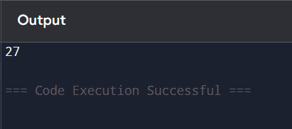

# List Operations in Python: Sum of List Items

## 🎯 Aim
To write a Python program that calculates the **sum of all elements** in a list.

## 🧠 Algorithm
1. Define a list of numbers.
2. Use Python’s built-in `sum()` function to calculate the total.
3. Print the result.

## 🧾 Program
```
newlist=[3,6,5,4,9]
print(sum(newlist))
```
## Output

## Result
The python program to calculate sum of all elements in a list is executed successfully.