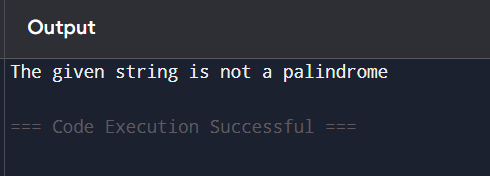

# Strings-Palindrome Check in Python (Without Built-in Functions)

## 🎯 Aim
To write a Python program to check whether the string `"google"` is a **palindrome** or not, without using built-in palindrome checking functions.

## 🧠 Algorithm
1. Assign the string `"google"` to a variable.
2. Reverse the string manually using slicing (`[::-1]`).
3. Compare the original string with the reversed string.
   - If they are equal, print that the string is a palindrome.
   - Otherwise, print that it is not a palindrome.
4. Execute the program.

## 🧾 Program
```
str="google"
a=str[::-1]
if str==a:
   print("The given string is a palindrome")
else:
   print("The given string is not a palindrome")
```
## Output

## Result
The program to check palindrome is executed successfully.